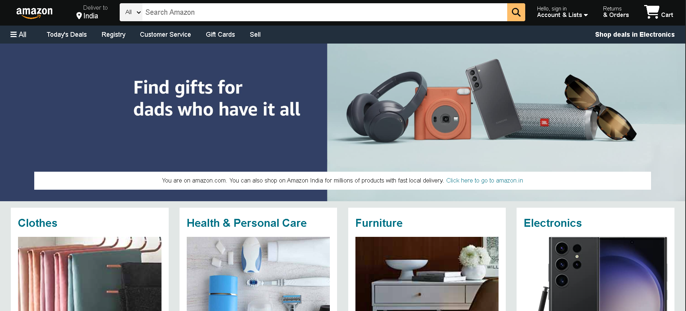

# 🛒 Amazon Clone

A responsive Amazon homepage clone built using **HTML** and **CSS**. This project recreates the look and feel of Amazon's landing page, including the navigation bar, hero section, shopping categories, and footer.

# 🌐 Live Demo

👉 https://nishika1505.github.io/Amazon-clone/

# 📸 Preview

# ✨ Features

- Responsive Amazon-style homepage
- Navigation bar with search box
- Hero banner section
- Product category boxes
- Footer similar to Amazon
- Clean UI using HTML & CSS only

# 🛠️ Technologies Used

- HTML5
- CSS3

## 🚀 How to Run

1. Clone the repository.
2. Open `index.html` in your browser.

## 📚 What I Learned

- Building responsive layouts with CSS
- Using Flexbox for alignment
- Creating navigation bars and hero sections
- Working with GitHub and GitHub Pages

## 👩‍💻 Author
**Nishika Sahni**
GitHub: https://github.com/nishika1505
